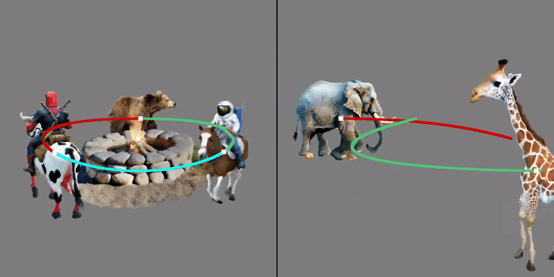

# TC4D: Trajectory-Conditioned Text-to-4D Generation



| [Project Page](https://sherwinbahmani.github.io/tc4d/) | [Paper](https://arxiv.org/abs/2403.17920) | [User Study Template](https://github.com/victor-rong/video-generation-study) |

- **This code is forked from [threestudio](https://github.com/threestudio-project/threestudio).**

## Installation

### Install threestudio

**This part is the same as original threestudio. Skip it if you already have installed the environment.**

- You must have an NVIDIA graphics card with at least 24 GB VRAM and have [CUDA](https://developer.nvidia.com/cuda-downloads) installed.
- Install `Python >= 3.8`.
- (Optional, Recommended) Create a virtual environment:

```sh
python3 -m virtualenv venv
. venv/bin/activate

# Newer pip versions, e.g. pip-23.x, can be much faster than old versions, e.g. pip-20.x.
# For instance, it caches the wheels of git packages to avoid unnecessarily rebuilding them later.
python3 -m pip install --upgrade pip
```

- Install `PyTorch >= 1.12`. We have tested on `torch1.12.1+cu113` and `torch2.0.0+cu118`, but other versions should also work fine.

```sh
# torch1.12.1+cu113
pip install torch==1.12.1+cu113 torchvision==0.13.1+cu113 --extra-index-url https://download.pytorch.org/whl/cu113
# or torch2.0.0+cu118
pip install torch torchvision --index-url https://download.pytorch.org/whl/cu118
```

- (Optional, Recommended) Install ninja to speed up the compilation of CUDA extensions:

```sh
pip install ninja
```

- Install dependencies:

```sh
pip install -r requirements.txt
```

### Install MVDream
MVDream multi-view diffusion model is provided in a different codebase. Install it by:

```sh
git clone https://github.com/bytedance/MVDream extern/MVDream
pip install -e extern/MVDream 
```

## Quickstart

Our model is trained in 3 stages and there are three different config files for every stage. Training has to be resumed after finishing a stage.

```sh
seed=0
gpu=0
exp_root_dir=/path/to

# Trajectory-conditioned generation
scene_setup_path=configs_prompts/a_deer_walking.yaml
# Stage 1
python launch.py --config configs/tc4d_stage_1.yaml --train --gpu $gpu exp_root_dir=$exp_root_dir seed=$seed system.prompt_processor.prompt="a deer walking" system.scene_setup_path=$scene_setup_path

# Stage 2
ckpt=/path/to/tc4d_stage_1/a_deer_walking@timestamp/ckpts/last.ckpt
python launch.py --config configs/tc4d_stage_2.yaml --train --gpu $gpu exp_root_dir=$exp_root_dir seed=$seed system.prompt_processor.prompt="a deer walking" system.scene_setup_path=$scene_setup_path system.weights=$ckpt

# Stage 3
ckpt=/path/to/tc4d_stage_2/a_deer_walking@timestamp/ckpts/last.ckpt
python launch.py --config configs/tc4d_stage_3.yaml --train --gpu $gpu exp_root_dir=$exp_root_dir seed=$seed system.prompt_processor.prompt="a deer walking" system.scene_setup_path=$scene_setup_path system.weights=$ckpt

# Compositional 4D Scene after training multiple stage 3 trajectory-conditioned prompts
# Add ckpts in the compositional config and define the trajectory list, see configs_comp for examples used in the paper
scene_setup_path=configs_comp/comp0.yaml
ckpt=/path/to/tc4d_stage_2/a_deer_walking@timestamp/ckpts/last.ckpt # Just a dummy input, overwritten by ckpts specified in the comp0.yaml
python launch.py --config configs/tc4d_stage_3.yaml --test --gpu $gpu exp_root_dir=$exp_root_dir seed=$seed system.prompt_processor.prompt="a deer walking" system.scene_setup_path=$scene_setup_path system.weights=$ckpt

# Render high resolution videos used in the paper and project page after training
ckpt=/path/to/tc4d_stage_3/a_deer_walking@timestamp/ckpts/last.ckpt
python launch.py --config configs/tc4d_stage_3_eval.yaml --test --gpu $gpu exp_root_dir=$exp_root_dir seed=$seed system.prompt_processor.prompt="a deer walking" system.scene_setup_path=$scene_setup_path system.weights=$ckpt
```

## Memory Usage
We tested our code on a A100 80 GB, but the memory can be reduced to 24 GB by adjusting following:
- Reduce system.renderer.base_renderer.train_max_nums to fit into the given memory. This reduces the number of sampled points which are part of the backpropagation
- Set system.guidance_video.low_ram_vae to a number between 1 and 16. This saves memory by only backpropagating through low_ram_vae number of frames instead of all 16.
Note that the convergence speed can be slower when reducing these parameters, the quality should not degrade however.

We provide 24 GB and 40 GB configs for stage 3, replace --config configs/tc4d_stage_3.yaml in the training command with: tc4d_stage_3_24_gb.yaml or tc4d_stage_3_40_gb.yaml

## Credits

This code is built on the [threestudio-project](https://github.com/threestudio-project/threestudio), [MVDream-threestudio](https://github.com/bytedance/MVDream-threestudio), [4D-fy-threestudio](https://github.com/sherwinbahmani/4dfy), and [VideoCrafter](https://github.com/AILab-CVC/VideoCrafter). Thanks to the maintainers for their contribution to the community!

## Citing

If you find TC4D helpful, please consider citing:

```
@article{bah2024tc4d,
  title={TC4D: Trajectory-Conditioned Text-to-4D Generation},
  author={Bahmani, Sherwin and Liu, Xian and Yifan, Wang and Skorokhodov, Ivan and Rong, Victor and Liu, Ziwei and Liu, Xihui and Park, Jeong Joon and Tulyakov, Sergey and Wetzstein, Gordon and Tagliasacchi, Andrea and Lindell, David B.},
  journal={arXiv},
  year={2024}
}
```
